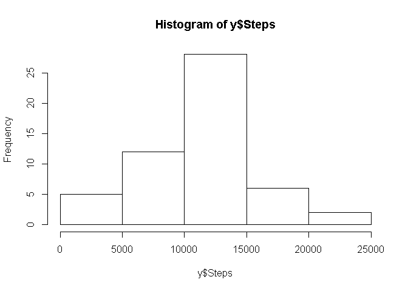
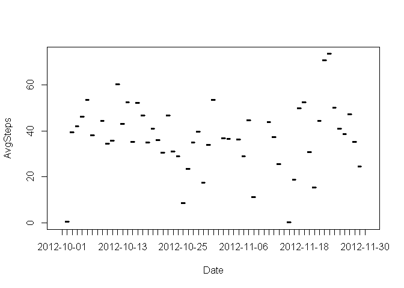
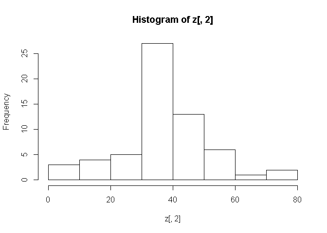
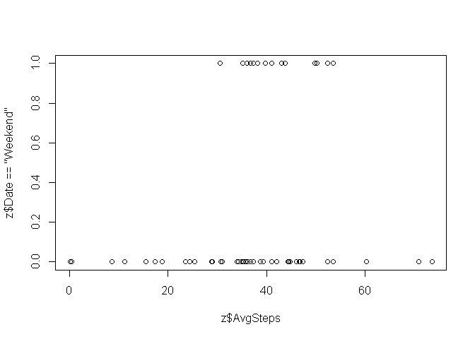
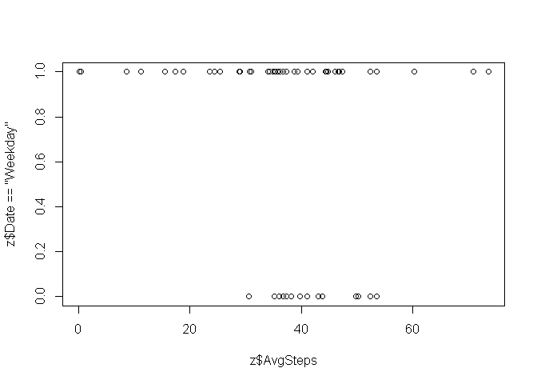

# Reproducible Research: Peer Assessment 1


## Loading and preprocessing the data

```r
     x <- read.csv("activity.csv") #code for reading data
     y <- aggregate(x$steps,by=list(x$date),sum) #code for processing data
     colnames(y) <- c("Date","Steps") #assigning column names
```


## What is mean total number of steps taken per day?

```r
     y #show data after processing
```

```
##          Date Steps
## 1  2012-10-01    NA
## 2  2012-10-02   126
## 3  2012-10-03 11352
## 4  2012-10-04 12116
## 5  2012-10-05 13294
## 6  2012-10-06 15420
## 7  2012-10-07 11015
## 8  2012-10-08    NA
## 9  2012-10-09 12811
## 10 2012-10-10  9900
## 11 2012-10-11 10304
## 12 2012-10-12 17382
## 13 2012-10-13 12426
## 14 2012-10-14 15098
## 15 2012-10-15 10139
## 16 2012-10-16 15084
## 17 2012-10-17 13452
## 18 2012-10-18 10056
## 19 2012-10-19 11829
## 20 2012-10-20 10395
## 21 2012-10-21  8821
## 22 2012-10-22 13460
## 23 2012-10-23  8918
## 24 2012-10-24  8355
## 25 2012-10-25  2492
## 26 2012-10-26  6778
## 27 2012-10-27 10119
## 28 2012-10-28 11458
## 29 2012-10-29  5018
## 30 2012-10-30  9819
## 31 2012-10-31 15414
## 32 2012-11-01    NA
## 33 2012-11-02 10600
## 34 2012-11-03 10571
## 35 2012-11-04    NA
## 36 2012-11-05 10439
## 37 2012-11-06  8334
## 38 2012-11-07 12883
## 39 2012-11-08  3219
## 40 2012-11-09    NA
## 41 2012-11-10    NA
## 42 2012-11-11 12608
## 43 2012-11-12 10765
## 44 2012-11-13  7336
## 45 2012-11-14    NA
## 46 2012-11-15    41
## 47 2012-11-16  5441
## 48 2012-11-17 14339
## 49 2012-11-18 15110
## 50 2012-11-19  8841
## 51 2012-11-20  4472
## 52 2012-11-21 12787
## 53 2012-11-22 20427
## 54 2012-11-23 21194
## 55 2012-11-24 14478
## 56 2012-11-25 11834
## 57 2012-11-26 11162
## 58 2012-11-27 13646
## 59 2012-11-28 10183
## 60 2012-11-29  7047
## 61 2012-11-30    NA
```

```r
     hist(y$Steps) #histogram
```

 

```r
     mean(y$Steps, na.rm = TRUE) #calculate mean
```

```
## [1] 10766.19
```

```r
     median(y$Steps, na.rm = TRUE) #calculate median
```

```
## [1] 10765
```


## What is the average daily activity pattern?

```r
     z <- aggregate(x$steps,by=list(x$date),mean)
     colnames(z) <- c("Date","AvgSteps")

     plot(z,type = "l")
```

 

```r
     summary(z) #getting the maximum step per 5-minute interval
```

```
##          Date       AvgSteps      
##  2012-10-01: 1   Min.   : 0.1424  
##  2012-10-02: 1   1st Qu.:30.6979  
##  2012-10-03: 1   Median :37.3785  
##  2012-10-04: 1   Mean   :37.3826  
##  2012-10-05: 1   3rd Qu.:46.1597  
##  2012-10-06: 1   Max.   :73.5903  
##  (Other)   :55   NA's   :8
```
## Imputing missing values

```r
     z[,2] #before
```

```
##  [1]         NA  0.4375000 39.4166667 42.0694444 46.1597222 53.5416667
##  [7] 38.2465278         NA 44.4826389 34.3750000 35.7777778 60.3541667
## [13] 43.1458333 52.4236111 35.2048611 52.3750000 46.7083333 34.9166667
## [19] 41.0729167 36.0937500 30.6284722 46.7361111 30.9652778 29.0104167
## [25]  8.6527778 23.5347222 35.1354167 39.7847222 17.4236111 34.0937500
## [31] 53.5208333         NA 36.8055556 36.7048611         NA 36.2465278
## [37] 28.9375000 44.7326389 11.1770833         NA         NA 43.7777778
## [43] 37.3784722 25.4722222         NA  0.1423611 18.8923611 49.7881944
## [49] 52.4652778 30.6979167 15.5277778 44.3993056 70.9270833 73.5902778
## [55] 50.2708333 41.0902778 38.7569444 47.3819444 35.3576389 24.4687500
## [61]         NA
```

```r
     length(z[,2][is.na(z[,2])]) #identifying the number of NA data
```

```
## [1] 8
```

```r
     z[,2][is.na(z[,2])]<-mean(z$AvgSteps,na.rm = TRUE) #imput missing data strategy
     z[,2] #after
```

```
##  [1] 37.3825996  0.4375000 39.4166667 42.0694444 46.1597222 53.5416667
##  [7] 38.2465278 37.3825996 44.4826389 34.3750000 35.7777778 60.3541667
## [13] 43.1458333 52.4236111 35.2048611 52.3750000 46.7083333 34.9166667
## [19] 41.0729167 36.0937500 30.6284722 46.7361111 30.9652778 29.0104167
## [25]  8.6527778 23.5347222 35.1354167 39.7847222 17.4236111 34.0937500
## [31] 53.5208333 37.3825996 36.8055556 36.7048611 37.3825996 36.2465278
## [37] 28.9375000 44.7326389 11.1770833 37.3825996 37.3825996 43.7777778
## [43] 37.3784722 25.4722222 37.3825996  0.1423611 18.8923611 49.7881944
## [49] 52.4652778 30.6979167 15.5277778 44.3993056 70.9270833 73.5902778
## [55] 50.2708333 41.0902778 38.7569444 47.3819444 35.3576389 24.4687500
## [61] 37.3825996
```

```r
     hist(z[,2]) #histgram after missing imput data
```

 


## Are there differences in activity patterns between weekdays and weekends?


```r
     z$Date <- weekdays(as.Date(z$Date)) #classifiying data to weekend and weekday
     z[,1][z[,1]=="Monday"]<-"Weekday"
     z[,1][z[,1]=="Tuesday"]<-"Weekday"
     z[,1][z[,1]=="Wednesday"]<-"Weekday"
     z[,1][z[,1]=="Thursday"]<-"Weekday"
     z[,1][z[,1]=="Friday"]<-"Weekday"
     z[,1][z[,1]=="Saturday"]<-"Weekend"
     z[,1][z[,1]=="Sunday"]<-"Weekend"
     summary(z)
```

```
##      Date              AvgSteps      
##  Length:61          Min.   : 0.1424  
##  Class :character   1st Qu.:34.0938  
##  Mode  :character   Median :37.3826  
##                     Mean   :37.3826  
##                     3rd Qu.:44.4826  
##                     Max.   :73.5903
```

```r
     plot(z$AvgSteps,z$Date=="Weekend") #plot across weekend
```

 

```r
     plot(z$AvgSteps,z$Date=="Weekday") #plot across weekday
```

 

